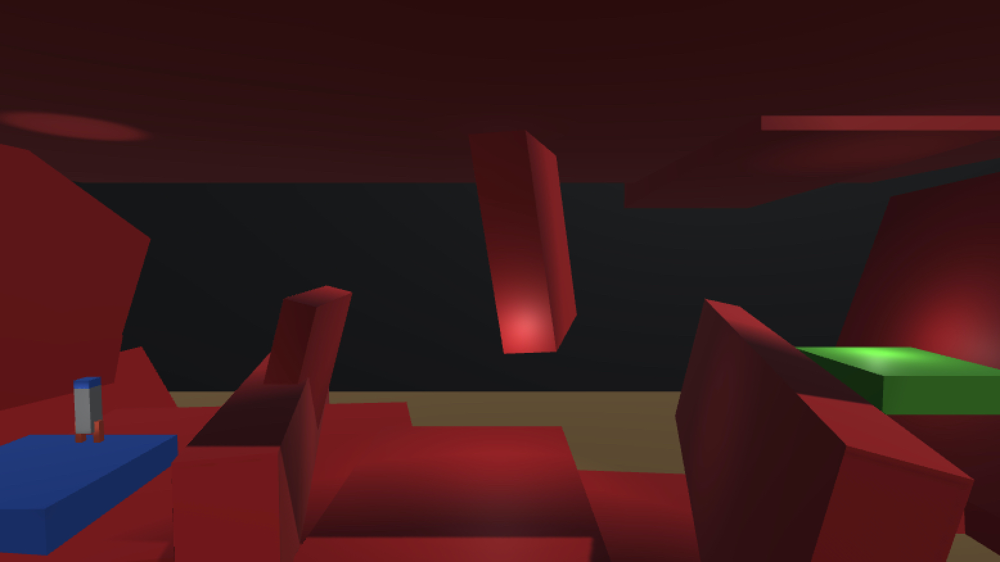
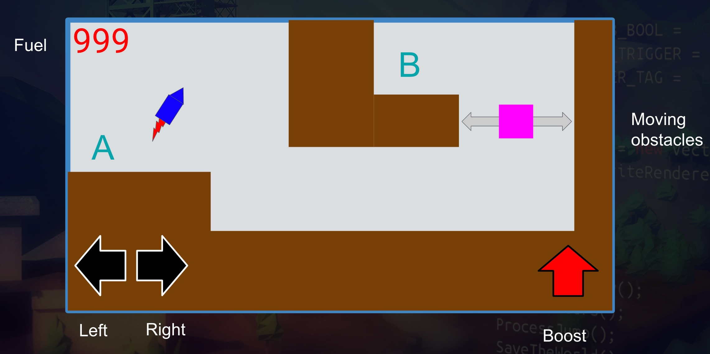
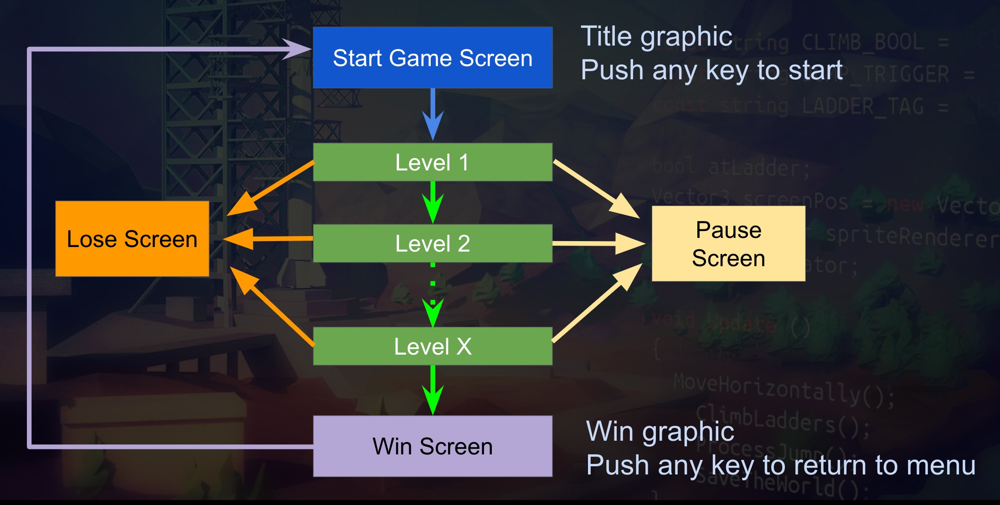
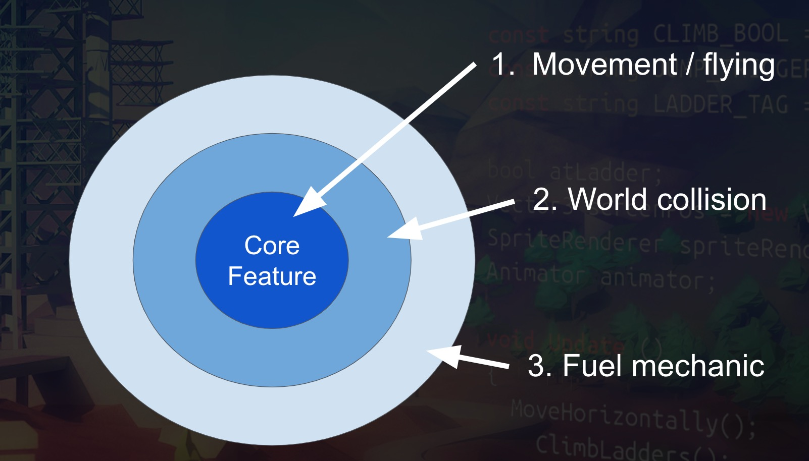

# ProjectBoost
This is a 2.5D space piloting game inspired by the BBC Micro classic Thrust.

This is the third section of the [Complete Unity Developer 2.0 course](https://www.udemy.com/unitycourse2).

## Demo

## Game Design

* Player Experience: Skilled rocket pilot
* Core Mechanic: Skillfully fly spaceship and avoid environment without running out of fuel.
* Core game loop:Get from A to B to complete the level, then progress to the next level.

## Game Theme
* Experimental early generation spacecraft.
* On an unknown planet, trying to escape.

## Game Flow & Screens

   
## Onion Design

## Tech Specs
* 1920x1080 16:9 aspect ratio.
* Build to web, iOS & Android.
* Mono audio including SFX and background music.